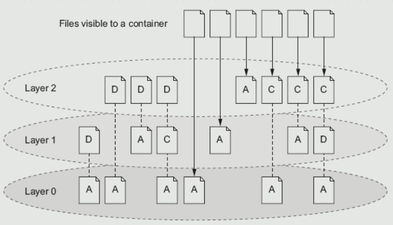
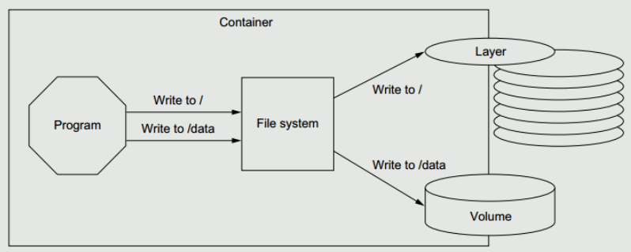

# Docker

## 容器 V.S. 虚拟机

+ 容器是另外一种轻量级的虚拟化，容器是共用主机内核，利用内核的虚拟化技术隔离出一个独立的运行环境，拥有独立的一个文件系统，网络空间，进程空间视图等。

+ 容器是在Linux内核实现的轻量级资源隔离机制

+ 虚拟机是操作系统级别的资源隔离，容器本质上是进程级的资源隔离

## Docker Engine

+ Docker daemon就是Docker Engine，一般在宿主主机后台运行。

+ 用户使用client通过pipe、unix socket或tcp直接跟daemon交互。

+ Docker index指向Docker registries，也叫docker仓库，可以用来让你上传和下载images。Hub.docker.com为docker官方仓库

## Docker常用命令

docker container：与容器相关的命令

docker container ls –aq：显示id

docker inspect 容器名：显示容器信息

docker image：镜像相关，ls列出镜像

docker network：与网络相关，容器间通信

docker version：client和server的版本号和OS系统（服务端是在linux虚拟机上面）

docker info：查看配置信息

docker pull：从远程仓库拉取镜像

docker port：查看端口映射

docker ps：查看正在运行的容器

docker attach <容器 ID>：附着到容器

docker exec -it <容器 ID>  /bin/bash：进入容器，执行命令

docker rm -f  <容器 ID>：删除容器

docker container prune：清理掉所有处于终止状态的容器

docker stop、docker start、docker restart、docker rm、docker rmi

## docker run参数

长的参数是--，短的参数是-

docker run hello-world

-d: 后台运行容器，并返回容器ID

-i: 以交互模式运行容器，通常与 -t 同时使用

-t: 为容器重新分配一个伪输入终端，通常与 -i 同时使用

-p: 指定（发布）端口映射，格式为：主机(宿主)端口:容器端口

-P: 随机端口映射，容器内部端口随机映射到主机的高端口（Dockerfile中使用expose才起作用）

--name="nginx-lb": 为容器指定一个名称（之后查询容器就不需要id，只要用名字就能访问）

-e username="ritchie": 设置环境变量（系统中的环境变量会有这个，可以传初始化参数）

--env-file=c:/temp1/t.txt: 从指定文件读入环境变量

--expose=2000-2002: 开放（暴露）一个端口或一组端口；

--link my-mysql:taozs : 添加链接到另一个容器

-v c:/temp1:/data: 绑定一个卷(volume)

--rm  退出时自动删除容器

## 镜像分层

写时复制，保证线程安全。修改时才复制过去修改的层，否则就用下面的层

## 数据卷

+ Docker-managed volume（docker管理卷）：docker帮你管理你的数据，存在哪里由docker决定，镜像删除文件也不删除

+ Bind mount volume（绑定挂载卷）：自己决定数据存在哪里

### 命令

docker volume create edc-nginx-vol：创建一个自定义容器卷 

docker volume ls：查看所有容器卷

docker volume inspect edc-nginx-vol：查看指定容器卷详情信息

docker inspect -f {{.Mounts}} b1

docker volume rm edc-nginx-vol：删除自定义数据卷

### 创建使用指定卷的容器

docker run -d --name=edc-nginx -p 8800:80 -v edc-nginx-vol:/usr/share/nginx/html nginx  注意：-v 后面只有一个目录名，则指的是在容器中目录，然后会自动创建一个volume与它对应。如果edc-nginx-vol不存在，则会自动创建一个volume

docker run -d --name=edc-nginx -v /app/wwwroot:/usr/share/nginx/html nginx

docker rm -v：命令在删除容器时删除该容器的卷

docker volume prune

docker cp c:/temp1 first:/data ：在主机与容器之间COPY

docker cp first:/data /tmp

## 导入导出

docker export 1e560fca3906 > ubuntu.tar

导出容器 1e560fca3906 快照到本地文件 ubuntu.tar

docker import ubuntu.tar test/ubuntu:v1

将快照文件 ubuntu.tar 导入到镜像 test/ubuntu:v1

 docker import http://example.com/exampleimage.tgz example/imagerepo

## 容器网络

cat /etc/hosts：查看ip地址

容器和容器之间互相通信

none网络，--net=none

host网络，--net=host

bridge网络，--net=bridge ， docker0 的 linux bridge

container模式，--net=container:NAME_or_ID

### 建立两个网络的连接

 connect NETWORK CONTAINER：将容器搭到别的网络里面，让一个容器同时连着两个网络