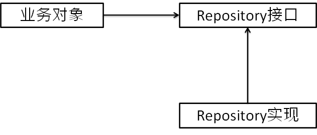
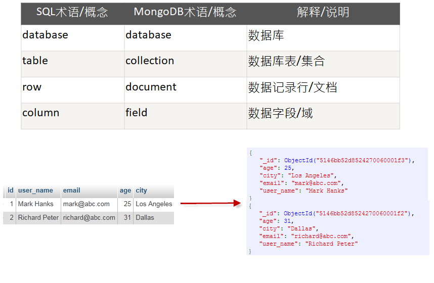

# Persistence

## Spring的模板方法

父类和子类的中的方法，业务逻辑不一样，实现上有细微差别的方法就是模板方法。

Spring将整个数据库的访问模板建好，用户只需要关心数据库语句的实现。

模板方法定义过程的主要框架，template

+ 管理资源（连接、statement）

+ 事务控制

+ 处理异常

变化的部分，回调（callback），自定义的数据访问代码

Spring提供的模板（后两个不怎么用，因为跟Spring强绑定在一起）

+ `JdbcTemplate`

+ `HibernateTemplate`

+ `JpaTemplate`


## JDBC

### 持久化数据



持久层实现接口分离

1. 运行测试业务逻辑时，业务测试对象可以mock
2. 方便替换持久化实现层，具体的数据库可以随便换，不影响数据库。

### 异常

#### `SQLException`

+ 发生异常时很难恢复

+ 难确定异常类型

#### `Hibernate`异常

+ 定义了许多具体异常，方便定位问题

+ 对业务对象的侵入

#### `Spring`所提供的平台无关的持久化异常

+ `DataAccessException`，将上面两个异常转换成这个异常

+ 具体异常，方便定位问题

+ 隔离具体数据库平台

### 配置数据源方式

#### 通过 JNDI 查找的数据源

Java 命名与目录接口（Java Naming and Directory Interface）

在Web容器中配置JNDI参数，定义一个数据源（数据名字）

Spring中配置JNDI数据源

```xml
<jee:jndi-lookup id=“dataSource”
 jndi-name=“/jdbc/**DS”
resource-ref=“true”/>
```

#### 连接池的数据源

将数据库的连接放在一个池子里面，只要有人需要就将池子里面的连接传给他。因为将一个连接创建与删除消耗时间，连接池可以减少消耗。

数据源连接池的开源实现

+ Apache Commons DBCP

#### 通过 JDBC 驱动程序定义的数据源

两种数据源

+ `DriverManagerDataSource`：注意没有进行池化处理，每次都是赶回一个新的连接。

+ `SingleConnectionDataSource`：只有一个连接的池，每次都是返回这个连接。

与具备池功能的数据源相比，唯一的区别在于这些数据源bean都没有提供连接池功能，所以没有可配置的池相关属性。生产环境不建议使用，还是用数据源连接池。

#### 配置嵌入式数据源

`<jdbc:embedded-database>`

可以创建数据表和初始化数据，只要程序停止数据源就消失

用于开发和测试

#### Java配置

```java
@Configuration
public class JdbcConfig {
    
    @Profile("ut")
    @Bean
    public DataSource dataSource() { // 嵌入式的内存数据库，放在本地内存，关掉程序就消失
        return new EmbeddedDatabaseBuilder()
                .setType(EmbeddedDatabaseType.H2) 
                .addScripts("classpath:spittr/db/jdbc/schema.sql", "classpath:spittr/db/jdbc/test-data.sql")
                .build();
    }

    @Profile("qa")
    @Bean
    public DataSource dataSource2() { // jdbc驱动的数据源，每次重新创建连接
        DriverManagerDataSource ds = new DriverManagerDataSource();
        ds.setDriverClassName("com.mysql.jdbc.Driver");
        ds.setUrl("jdbc:mysql://localhost:3306/exampledb6");
        ds.setUsername("root");
        ds.setPassword("exampledb20");
        return ds;
    }
    
    @Profile("prod")
    @Bean
    public DataSource dataSource3() { // 连接池的数据源
        BasicDataSource ds = new BasicDataSource();
        ds.setDriverClassName("com.mysql.jdbc.Driver");
        ds.setUrl("jdbc:mysql://localhost:3306/exampledb6");
        ds.setUsername("root");
        ds.setPassword("exampledb20");
        ds.setInitialSize(5); // 初始化的连接源
        ds.setMaxActive(10); // 最多的连接数
        return ds;
    }
    
    @Bean
    public JdbcTemplate jdbcTemplate(DataSource dataSource) {
        return new JdbcTemplate(dataSource);
    }

}
```

#### XML配置

```xml
<beans>
    <beans profile="ut">
        <jdbc:embedded-database id="dataSource" type="H2">
            <jdbc:script location="classpath:spittr/db/jdbc/schema.sql"/>
            <jdbc:script location="classpath:spittr/db/jdbc/test-data.sql"/>
        </jdbc:embedded-database>
    </beans>

    <beans profile="qa">
        <bean id="dataSource" class="org.springframework.jdbc.datasource.DriverManagerDataSource"
              p:driverClassName="com.mysql.jdbc.Driver"
              p:url="jdbc:mysql://localhost:3306/exampledb6"
              p:username="root"
              p:password="exampledb20"/>
    </beans>

    <beans profile="prod">
        <bean id="dataSource" class="org.apache.commons.dbcp.BasicDataSource"
              destroy-method="close"
              p:driverClassName="com.mysql.jdbc.Driver"
              p:url="jdbc:mysql://localhost:3306/exampledb6"
              p:username="root"
              p:password="exampledb20"/>
    </beans>
</beans>
```

### Profile选择数据源

`@ActiveProfiles("ut")`

### 两种模板

#### `JdbcTemplate`

```java
private static final String INSERT_SPITTER = "insert into Spitter (username, password, fullname, email, updateByEmail) values (?, ?, ?, ?, ?)";
```

#### `NamedParameterJdbcTemplate`

```java
private static final String INSERT_SPITTER = "insert into Spitter (username, password, fullname, email, updateByEmail) values (:username, :password, :fullname, :email, :updateByEmail)";
```


## Hibernate

### ORM

`object-relational mapping`、`Object_Relative DateBase-Mapping`

在Java对象与关系数据库之间建立某种映射，以实现直接存取Java对象

例子：`Hibernate`、`MyBatis`、`JPA` (Java Persistence API)

### 配置

`org.hibernate.Session`接口

获得`org.hibernate.SessionFactory`对象，负责Session的打开、关闭、管理

Session接口提供了基本的数据访问功能。通过Session接口，应用的Repository能满足所有的持久化需求

+ `org.springframework.orm.hibernate4.LocalSessionFactoryBean`

定义映射关系：XML、注解（JPA、Hibernate）

```java
@Configuration
@EnableTransactionManagement
@ComponentScan
public class RepositoryTestConfig implements TransactionManagementConfigurer {

    @Inject
    private SessionFactory sessionFactory;

    @Bean
    public DataSource dataSource() {
        EmbeddedDatabaseBuilder edb = new EmbeddedDatabaseBuilder();
        edb.setType(EmbeddedDatabaseType.H2);
        edb.addScript("spittr/db/hibernate4/schema.sql");
        edb.addScript("spittr/db/hibernate4/test-data.sql");
        EmbeddedDatabase embeddedDatabase = edb.build();
        return embeddedDatabase;
    }

    public PlatformTransactionManager annotationDrivenTransactionManager() {
        System.out.println(sessionFactory);
        HibernateTransactionManager transactionManager = new HibernateTransactionManager();
        transactionManager.setSessionFactory(sessionFactory);
        return transactionManager;
    }

    @Bean
    public SessionFactory sessionFactoryBean() {
        try {
            LocalSessionFactoryBean lsfb = new LocalSessionFactoryBean();
            lsfb.setDataSource(dataSource());
            lsfb.setPackagesToScan("spittr.domain");
//      lsfb.setAnnotatedClasses();
            Properties props = new Properties();
            props.setProperty("dialect", "org.hibernate.dialect.H2Dialect");
//      props.setProperty("dialect", "org.hibernate.dialect.MySQL5Dialect");
            lsfb.setHibernateProperties(props);
            lsfb.afterPropertiesSet();
            SessionFactory object = lsfb.getObject();
            return object;
        } catch (IOException e) {
            return null;
        }
    }

    @Bean
    public BeanPostProcessor persistenceTranslation() {
        return new PersistenceExceptionTranslationPostProcessor();
    }
}
```

### 三类查询

HQL: `hibernate query language`，即hibernate提供的面向对象的查询语言

+ `select/update/delete…… from …… where …… group by …… having …… order by …… asc/desc`

QBC查询: query by criteria 完全面向对象的查询

本地SQL查询

```java
@ContextConfiguration(classes = RepositoryTestConfig.class)
public class OtherTest {

    @Autowired
    SessionFactory sessionFactory;

    //HQL:hibernate query language，即hibernate提供的面向对象的查询语言
    @Test
    @Transactional
    public void hqlTest1() {
        Query query = sessionFactory.getCurrentSession().createQuery("FROM Spitter");
        List<Spitter> list = query.list();
        System.out.println(list);
    }

    @Test
    @Transactional
    public void hqlTest2() {
        Query query = sessionFactory.getCurrentSession().createQuery("FROM Spitter where id = ?");
        query.setParameter(0, 2L);
        List<Spitter> list = query.list();
        System.out.println(list);
    }


    //QBC查询: query by criteria 完全面向对象的查询
    @Test
    @Transactional
    public void qbcTest() {
        Criteria criteria = sessionFactory.getCurrentSession().createCriteria(Spitter.class);
        criteria.add(Restrictions.eq("id", 2L));
        List<Spitter> list = criteria.list();
        System.out.println(list);
    }

    //本地SQL查询
    @Test
    @Transactional
    public void sqlTest() {
        SQLQuery sqlQuery = sessionFactory.getCurrentSession().createSQLQuery("SELECT * FROM spitter").addEntity(Spitter.class);
        List<Spitter> list = sqlQuery.list();
        System.out.println(list);
    }
}
```


## JPA

JPA的宗旨是为POJO提供持久化标准规范

JPQL（Java Persistence Query Language)

JPQL就是一种查询语言，具有与 SQL 相类似的特征

JPA语法大全

### 配置

`javax.persistence.EntityManager`（功能相当于session对象）

实体管理器工厂（entity manager factory）

+ `org.springframework.orm.jpa.LocalContainerEntityManagerFactoryBean`

+ `org.springframework.orm.jpa.vendor.HibernateJpaVendorAdapter`

```java
@Configuration
@EnableJpaRepositories(basePackages="spittr.db")
public class JpaConfig {

  @Bean
  public DataSource dataSource() {
    EmbeddedDatabaseBuilder edb = new EmbeddedDatabaseBuilder();
    edb.setType(EmbeddedDatabaseType.H2);
    edb.addScript("spittr/db/jpa/schema.sql");
    edb.addScript("spittr/db/jpa/test-data.sql");
    EmbeddedDatabase embeddedDatabase = edb.build();
    return embeddedDatabase;
  }

  @Bean
  public LocalContainerEntityManagerFactoryBean entityManagerFactory(DataSource dataSource, JpaVendorAdapter jpaVendorAdapter) {
    LocalContainerEntityManagerFactoryBean emf = new LocalContainerEntityManagerFactoryBean();
    emf.setDataSource(dataSource);
    emf.setPersistenceUnitName("spittr");
    emf.setJpaVendorAdapter(jpaVendorAdapter);
    emf.setPackagesToScan("spittr.domain");
    return emf;
  }
  
  @Bean
  public JpaVendorAdapter jpaVendorAdapter() {
    HibernateJpaVendorAdapter adapter = new HibernateJpaVendorAdapter();
    adapter.setDatabase(Database.H2);
    adapter.setShowSql(true);
    adapter.setGenerateDdl(false);
    adapter.setDatabasePlatform("org.hibernate.dialect.H2Dialect");
    return adapter;
  }
  

  @Configuration
  @EnableTransactionManagement
  public static class TransactionConfig {

    @Inject
    private EntityManagerFactory emf;

    @Bean
    public PlatformTransactionManager transactionManager() {
      JpaTransactionManager transactionManager = new JpaTransactionManager();
      transactionManager.setEntityManagerFactory(emf);
      return transactionManager;
    }    
  }
  
}

```

### 获取

```java
@PersistenceContext
private EntityManager entityManager;
//并不会真正注入EntityManager，因为它不是线程安全的，
//注入的是一个代理，通过代理关联到当前事务上下文的真正的EntityManager
//    下面是直接注入EntityManager的方法
//    @PersistenceUnit
//    private EntityManagerFactory emf;
//    emf.createEntityManager();
```

### JPARepository

定义查询方法，无需实现

+ 领域特定语言（domain-specific language，DSL)，spring data的命名约定

+ 查询动词 + 主题 + 断言

+ 查询动词：get、read、find、count

声明自定义查询

+ 不符合方法命名约定时，或者命名太长时

+ @Query(“select ...”)

使用EntityManager直接低层实现

+ 接口名+Impl的实现类

#### 实现代码

```java
public interface SpitterRepository extends JpaRepository<Spitter, Long>, SpitterSweeper {

    Spitter findByUsername(String username);

    List<Spitter> findByUsernameOrFullNameLike(String username, String fullName);

    @Query("select s from Spitter s where s.email like '%gmail.com'") // 自己实现查询方法
    List<Spitter> findAllGmailSpitters();
}
```

#### 用接口实现自己的方法

```java
public class SpitterRepositoryImpl implements SpitterSweeper {

   @PersistenceContext
   private EntityManager em;
   
   public int eliteSweep() {
     String update = 
         "UPDATE Spitter spitter " +
             "SET spitter.status = 'Elite' " +
             "WHERE spitter.status = 'Newbie' " +
             "AND spitter.id IN (" +
             "SELECT s FROM Spitter s WHERE (" +
             "  SELECT COUNT(spittles) FROM s.spittles spittles) > 10000" +
             ")";
      return em.createQuery(update).executeUpdate();
   }
   
}
```


## MongoDB

### NoSQL

NoSQL(Not Only SQL) ，指的是非关系型的数据库

- 没有声明性查询语言

- 没有预定义的模式

类型：`键-值对存储`、`列存储`、`文档存储`、`图形数据库`

MongoDB是一种非关系型数据库。

### 术语



### MongoDB shell

MongoDB Shell是MongoDB自带的交互式Javascript shell,用来对MongoDB进行操作和管理的交互式环境

#### 指令

```bash
show dbs
db
db.something.insert({x:10})
db.something.find()
```


### Spring Data MongoDB

```java
@Configuration
@EnableMongoRepositories(basePackages = "orders.db")
public class MongoConfig extends AbstractMongoConfiguration {

	@Override
	protected String getDatabaseName() {
		return "OrdersDB";
	}
	
	@Override
	public MongoClient mongo() throws Exception {
		return new MongoClient();
	}

}
```

```java
public interface OrderRepository extends MongoRepository<Order, String> {
	
	List<Order> findByCustomer(String customer);
	
	List<Order> findByCustomerLike(String customer);

	List<Order> findByCustomerAndType(String customer, String type);

	List<Order> getByType(String type);
		
	@Query("{customer:'Chuck Wagon'}") // 自己的查询
	List<Order> findChucksOrders();

}
```

```java
@Document
public class Order {
	
	@Id
	private String id;
	
	@Field("client")
	private String customer;
	
	private String type;
	
	private Collection<Item> items = new LinkedHashSet<>(); // Item不单独持久化为文档，他始终是Order文档中的Item列表的的一个成员，并且会作为文档中的嵌入元素
}
```
