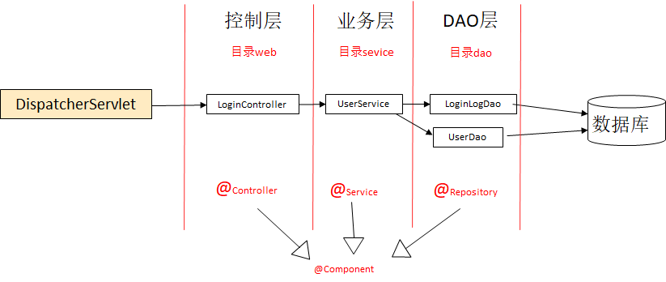
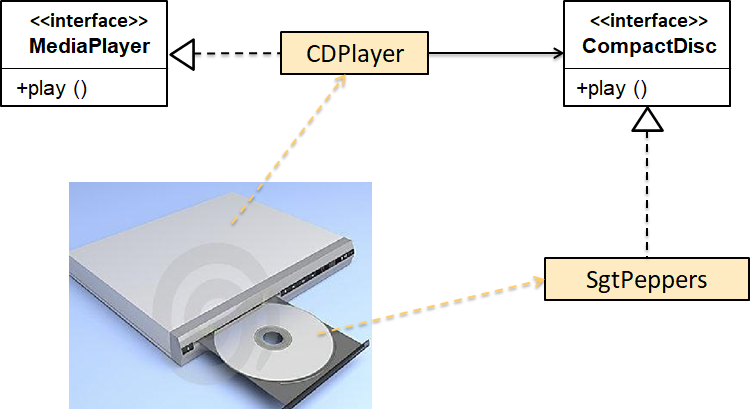
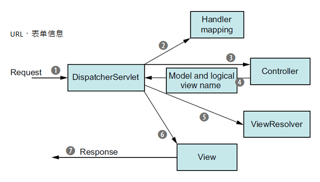
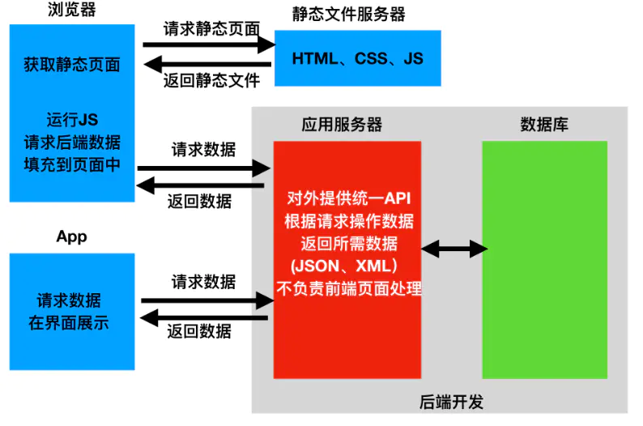
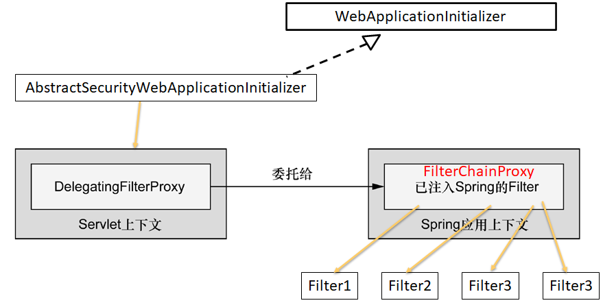

# Spring Basics

## Web开发

### web分层（重点）



- `Model`：给view层展示的数据
- `View`：HTML文件
- `Controller`：控制层

### Spring模块组成


### 测试

#### 注解

- `@Before`，每一个测试前先调用
- `@After`，每一个测试后调用
- `@BeforeClass`，全部测试前调用
- `@AfterClass`，全部测试后调用
- `@Ignore`，忽略该测试

#### Mockito

 打桩，可以模拟某个类的输出，进行单元测试。

```java
mock(A.class, RETURN_SMART_NULL); // 避免指向空的而报错
when(mockList.get(0)).thenReturn("first");
System.out.println(mockList.get(0)); // print "first"
```

## 依赖注入（Bean装配）

### 案例



### 自动化配置Bean

#### 注解

`@Component` == `@Bean`，是说在运行的时候，实例化这么一个对象。

`@Autowired`，CDPlayer需要依赖于CompactDisc对象，所以会在spring容器里找这个对象，@Autowired会将这个bean自动注入。require = false可以避免没装载而报错。

`@ComponentScan`，启用组件扫描，查找带有`@Component`的所有类，并且创建bean，默认以配置类为基础包，扫描这个包与这个包下面的所有子包，可以使用`basePackages = {}`添加，但是这个是类型不安全，因为是字符串，所以推荐用`basePackageClasses = {}`指定类或接口，这些类所在的包会作为扫描的基础包。

命名方法：`@Component("a")`、`@Named("a")`

#### 坏处

无法使用第三方库。

### JavaConfig

#### 注解

`@Configuration`，表明这个类是配置类。

`@Scope`，定义单例、多例、作用域，默认是单例。

`@Bean`，声明一个bean，创建所需类型的实例，这个方法的返回对象会被作为spring中的bean

命名方法：`@Bean(name="a")`，默认是方法名。

#### 传参

可以用@bean注解的方法进行传参，在初始化时将参数传进bean方法里面，其中这个参数可以在任何地方进行定义如xml、其他配置类、自动扫描和装配bean中。

```java
@Configuration
public class CDPlayerConfig {

    @Bean
    public CompactDisc compactDisc() {
        return new SgtPeppers();
    }

    @Bean
    public CDPlayer cdPlayer1() {
        return new CDPlayer(compactDisc());
    }

    @Bean
    public CDPlayer cdPlayer2() {
        return new CDPlayer(compactDisc());
    }
}
```

如果是调用其他的方法，比如A创建后，B调用A的创建方法是可以的。但是这个方法会被拦截，如果已经被创建了就不会再调用。也就是说系统中只会有一个CDPlayer对象。如果要使用多个则将@Scope改为多例。

### XML配置

#### 创建bean

```xml
<bean id="compactDisc" class="soundsystem.SgtPeppers" />
```

测试用例于xml名字保持一致，这样就会自动寻找配置文件

#### 初始化

引用（类）：\<constructor-arg ref="…" />  等价 c-命名空间  c:cd-ref=“…” c:(参数名、\_0、_)-ref

值（字面量）：\<constructor-arg value="…" />  等价 c-命名空间  c:\_title=“…” c:(\_参数名、\_0、_)

（构造函数中的参数名、参数顺序、只有一个构造参数的话只需要下划线）

#### 装配集合

构造函数如果有list或是set的话

null:  \<null/>、集合：\<list>或\<set>

#### 属性注入

```xml
<bean>
    <property name=".." ref=".."/>
</bean>
```

将属性透过setter方法注入bean中

```xml
<property name="..">
    <list>
        <value>
    </list>
</property>
```

p命名空间：p:属性名-ref=".."

```xml
<util:list id=“…”>
    <value>…</value>
</util:list>
```

p命名空间：p:tracks-ref=".."

#### 好处

没有对Spring框架的依赖性。

### 混合配置

#### JavaConfig混xml

`@Import`，将java的configuration配置到另一个java的configuration上面。

`@ImportResource`，将xml的配置配置到java的configuration上面。

#### xml混JavaConfig

```xml
<import resource="xml文件"/>
<bean class="配置类"/>
```

#### 根配置

一个Configuration，里面导入其他配置，java的一个总的配置。

##### XML

```xml
<context:component-scan base-package=“…”/>
<import resource="xml文件"/>
<bean class="配置类"/>
```

##### JavaConfig

`@Configeration`

`@ComponetScan`

`@Import` (其它配置类…)

`@ImportResource` (其它xml文件)

### 多环境注解

```java
@Configuration
public class DataSourceConfig {

   @Bean(destroyMethod = "shutdown")
   @Profile("dev")
   public DataSource embeddedDataSource() {
   }

   @Bean
   @Profile("prod")
   public DataSource jndiDataSource() {
   }

}
```

激活方法：@ActiveProfiles(“dev”)

## AOP

### 定义

面向切面编程：减少继承（inheritance）、委托（delegation），避免代码侵入性，开闭原则。（委托就是将数据传给其他对象，让其他对象进行需要的操作）

### 横切关注点

- 日志
- 安全
- 事务
- 缓存

### 术语

- 通知（Advice）切面的逻辑，像是silenceCellPhones方法 + @Before注解
- 切点（Poincut）：何处切入，这个切面要在哪里插入，@Before("execution(* concert.Performance.perform( .. ))")。
- 切面（Aspect）：Advice和Poincut的结合。也就是整个类。
- 连接点（Join point）：具体的切入点，应用中能插入切面的一个点
- 引入（introduction）：引入新的行为和状态。
- 织入（Weaving）：切面应用到目标对象的过程，创建新的代理对象，切面在指定的连接点被织入到目标对象。

### Spring实现

```java
@Aspect
public class Audience https://github.com/RIAEvangelist/node-ipc/issues/425

    @Pointcut("execution(* concert.Performance.perform( .. ))")
    public void performance() {
    }

    @Before("performance()")
    public void silenceCellPhones() {
        System.out.println("Silencing cell phones");
    }

    @Before("performance()")
    public void takeSeats() {
        System.out.println("Taking seats");
    }

    @AfterReturning("performance()")
    public void applause() {
        System.out.println("CLAP CLAP CLAP!!!");
    }

    @AfterThrowing("performance()")
    public void demandRefund() {
        System.out.println("Demand a refund");
    }
    
    @Around("performance()") 
    public void watchPerformance(ProceedingJoinPoint joinPoint) {
        try {
            System.out.println(".Silencing cell phones");
            System.out.println(".Taking seats");
            joinPoint.proceed(); // 调用被织入的方法，可以多次重复
            System.out.println(".CLAP CLAP CLAP!!!");
        } catch (Throwable e) {
            System.out.println(".Demanding a refund");
        }
    }
}
```

```java
@Configuration
@EnableAspectJAutoProxy //开启AspectJ的自动代理机制
public class ConcertConfig {
    @Bean
    public Performance concert() {
        return new Concert();
    }
}
```

```java
public class MyAnnotationApp {
    public static void main(String[] args) {
        ApplicationContext ctx = new AnnotationConfigApplicationContext(ConcertConfig.class);

        Performance concert = ctx.getBean("concert", Performance.class); // 被注解影响
        concert.perform();
    }
}
```

在添加注解后，ctx获取的是代理对象，这个代理对象负责在适当的时机去调用切面的方法。

#### 支持类型

- @AspectJ注解驱动的切面
- 纯POJO切面，xml配置

> @EnableAspectJAutoProxy //开启AspectJ的自动代理机制

#### 注解

`@Pointcut` - 切点

`@Before` - 在之前

`@After` - 返回或是报错

`@AfterReturning` - 返回

`@AfterThrowing` - 报错

`@Around` - 环绕

#### 传递参数

AspectJ 切点指示器（pintcut designator）

```java
@Aspect
public class TrackCounter {
    private Map<Integer, Integer> trackCounts = new HashMap<>();

    @Pointcut(
            "execution(* soundsystem.CompactDisc.playTrack( int )) " +
                    "&& args(trackNumber)")
    public void trackPlayed(int trackNumber) {
    }

    @Before("trackPlayed(trackNumber)")
    public void countTrack(int trackNumber) {
        int currentCount = getPlayCount(trackNumber);
        trackCounts.put(trackNumber, currentCount + 1);
    }

    public int getPlayCount(int trackNumber) {
        return trackCounts.containsKey(trackNumber) ? trackCounts.get(trackNumber) : 0;
    }
}
/*
切点表达式
@Pointcut("execution(*com.springinaction.springidol.Performer.perform(..))") 查找有对应参数的方法
&& within(concert1.*, ...) 对某个特定包实施织入
&& bean(concert2, ...) 对某个特定bean实施织入
&& args(trackNumber, ...) 下面方法需要的参数名，多个参数则不断向后添加参数名
*/
```

#### introduction

织入新方法

```java
@Aspect
public class EncoreableIntroducer {
    @DeclareParents(value = "concert.Performance+",//后面的+表示应用到所有实现了该接口的Bean
            defaultImpl = DefaultEncoreable.class)
    public static Encoreable encoreable;
}
```

```java
public class MyAnnotationApp {
    public static void main(String[] args) {
        ApplicationContext ctx = new AnnotationConfigApplicationContext(ConcertConfig.class);

        Encoreable concert2 = (Encoreable)ctx.getBean("concert", Performance.class); // 代理是接口
        concert2.performEncore();
    }
}
```

#### XML实现

```xml
<beans>
    <aop:aspectj-autoproxy/>
    <aop:config>
        <aop:aspect ref="audience">
            <aop:before method="silenceCellPhones"
                        pointcut="execution(* concert.Performance.perform(..))"/>
            <aop:before method="takeSeats"
                        pointcut="execution(* concert.Performance.perform(..))"/>
            <aop:after method="applause"
                       pointcut="execution(* concert.Performance.perform(..))"/>
            <aop:after-throwing method="demandRefund"
                                pointcut="execution(* concert.Performance.perform(..))"/>
        </aop:aspect>
    </aop:config>
</beans>
```

- method = 切面
- pointcut = 切点
- aop:before = 织入时机

```xml
<beans>
    <aop:aspectj-autoproxy/>

    <bean id="concert" class="concert.Concert"/>
    <bean id="concert2" class="concert.Concert"/>
<!--    <bean id="encoreableDelegate" class="concert.DefaultEncoreable"/>-->
    
    
    <aop:config>
        <aop:aspect>
            <aop:declare-parents types-matching="concert.Performance+"
                                 implement-interface="concert.Encoreable"
                                 default-impl="concert.DefaultEncoreable"/>
<!--                                 delegate-ref="encoreableDelegate"/>-->

        </aop:aspect>
    </aop:config>
<\beans>
```

## Web框架（重点）

### MVC框架

#### 请求处理

DispatcherServelet 核心

Controller 逻辑核心

view Resolver 将数据渲染成浏览器可以处理的HTML文件



   

1. 请求离开浏览器，带有用户请求内容的信息、URL、表单信息。DispatcherServlet是所有前端请求的接口，她负责找请求对应的Spring MVC控制器。
2. 通过Handler mapping（处理器映射）根据所携带的URL来进行决策找到适合的控制器。
3. DispatcherServlet将请求发送给Spring MVC控制器，到了控制器，会将用户提交的信息传入控制器并等待控制器处理。要注意，控制器不是逻辑层，他只负责将业务委托给其他service处理。
4. 控制器完成逻辑处理之后，将返回的信息（Model）打包并且标识出用于渲染输出的视图（view）名，将这些东西返回给DispatcherServlet。
5. 因为避免视图相耦合，控制器只传送逻辑视图名。DispatcherServlet会将逻辑视图名传送给视图解析器（View Resolver）匹配为一个特定的视图实现。
6. View Resolver知道需要被渲染的视图后，还需要实现视图，将视图用模型数据渲染输出。
7. 将这个渲染好的东西通过响应对象传递给客户端。

#### DispatcherServlet

配置DispatcherServlet

```java
public class SpitterWebInitializer extends AbstractAnnotationConfigDispatcherServletInitializer {
  
  @Override
  protected Class<?>[] getRootConfigClasses() { // 监听器配置
    return new Class<?>[] { RootConfig.class };
  }

  @Override
  protected Class<?>[] getServletConfigClasses() { // 控制器和视图解析器配置
    return new Class<?>[] { WebConfig.class };
  }

  @Override
  protected String[] getServletMappings() {
    return new String[] { "/" };
  }

}
```

```java
@Configuration
@EnableWebMvc // 允许MVC的注解
@ComponentScan("spittr.web")
public class WebConfig extends WebMvcConfigurerAdapter {

    @Bean
    public ViewResolver viewResolver() { // 视图解析器
        InternalResourceViewResolver resolver = new InternalResourceViewResolver();
        resolver.setPrefix("/WEB-INF/views/");
        resolver.setSuffix(".jsp");
        return resolver;
    }
    
    @Override
    public void configureDefaultServletHandling(DefaultServletHandlerConfigurer configurer) { // 静态资源的请求直接转发给Servlet容器中默认的Servlet上面
        configurer.enable();
    }
}
```

```java
@Configuration
@Import(DataConfig.class) // 数据库
@ComponentScan(basePackages={"spittr"},  // 扫描控制器及其他信息
    excludeFilters={
        @Filter(type=FilterType.CUSTOM, value=WebPackage.class)
    })
public class RootConfig { 
  public static class WebPackage extends RegexPatternTypeFilter {
    public WebPackage() {
      super(Pattern.compile("spittr\\.web"));
    }    
  }
}
```

```java
@Controller
@RequestMapping("/")
public class HomeController {

  @RequestMapping(method = GET)
  public String home(Model model) {
    return "home";
  }

}
```

#### 根据URL指定控制器

`@RequestMapping("路径")`

#### 找到JSP文件

```java
resolver.setPrefix("/WEB-INF/views/");
resolver.setSuffix(".jsp");
```

加上文件名拼成指定的JSP文件，譬如`/WEB-INF/views/home.jsp`

#### 获得输入

- 查询参数（Query Parameter）：在URL里面有`?max=34  @RequestParam(“max”)`
- 路径参数（Path Variable）：占位符，在URL里面有 `"/{name}"` `@PathVariable("name")`
- 表单参数（Form Parameter）：参数名与对象字段名相同

### 前后端实现

#### 不分离

DispatcherServlet就是前后端不分离使用的。这一时期的典型技术是JSP。


#### 分离

不使用视图解析器，直接返回json文件，使用restful架构使服务端、客户端进行交互。



## Spring Security

### 过滤Web请求



创建一个WebApplicationInitializer截获消息，将消息发给DelegatingFilterProxy，DelegatingFilterProxy再委托给filter。

Spring中需要实现两个类，AbstractSecurityWebApplicationInitializer和WebSecurityConfigurerAdapter

```java
@Configuration
@EnableWebMvcSecurity // 启用安全性
public class SecurityConfig extends WebSecurityConfigurerAdapter{
    // 配如何通过拦截器保护请求
    void configure(HttpSecurity http);
    // 配用户数据存储
    void configure(AuthenticationManagerBuilder auth);
}
```

### 认证

信息会存在header里面的Authorization，账号和密码。

```java
@Override
  protected void configure(HttpSecurity http) throws Exception {
    http
      .formLogin() // login表格
        .loginPage("/login") // login视图页面
      .and()
        .logout()
          .logoutSuccessUrl("/")
      .and()
      .rememberMe() // 不需要重复登录
        .tokenRepository(new InMemoryTokenRepositoryImpl()) // remember me存的位置
        .tokenValiditySeconds(2419200) // 有效期
        .key("spittrKey")
      .and()
       .httpBasic()
         .realmName("Spittr")
      .and()
      .authorizeRequests()
        .antMatchers("/").hasAnyRole("USER") // 授权
        .antMatchers("/spitter/me").authenticated() // 需要被认证的页面
        .antMatchers(HttpMethod.POST, "/spittles").authenticated()
        .anyRequest().permitAll()
//    .and()
//            .requiresChannel() // 需要一个安全通道，tomcat中配置，建立HTTPS协议
//            .antMatchers("/spitter/register").requiresSecure() // 
//    .and().csrf().disable()
    ;

  }

  @Override
  protected void configure(AuthenticationManagerBuilder auth) throws Exception {
    auth
      .inMemoryAuthentication()
        .withUser("user").password("password").roles("USER"); // 存入用户信息在内存中
  }
}
```

#### Session Id

登录时，服务端会发一个session id，客户端将cookies中的session id存下来，每次请求就会将cookies在发回去，服务端就能知道是同一个人，所以如果客户端删掉了cookies中的session id，就等于是开启了一个新的会话，用户就要重新登陆。

#### Remember me

服务端在知道remember me被勾选之后，服务端会将remember me存下来，在下次客户端进行访问时，服务端会在remember me中寻找，如果找到则直接就能登录。

#### HTTPS

注册的时候，需要和浏览器建立安全通道，强制使用HTTPS，对信息进行加密。

总结来说就是服务端tomcat要配keystore，里面也有客户端的证书，客户端windows系统里也要有客户端证书，服务端证书ca。

### CSRF攻击

Spring使用同步token，CSRF token会存在表格中，将信息存在value中，服务端在获取请求时，会检查token进行认证。

如果没有这个信息，第三方网站对session id进行截获，并且向服务端进行访问，获取服务端中的私密信息。


### 方法保护

#### 注解

`@EnableGlobalMethodSecurity(securedEnabled=true)`

应该可以放到WebSecurityConfigurerAdapter，也就是WebSecurityConfigurerAdapter与GlobalMethodSecurityConfiguration合二为一，这样请求拦截和方法保护同时有效。

##### Spring自带注解

`@Secured({"ROLE_SPITTER", "ROLE_ADMIN"})`  // 可调用该方法的角色

`securedEnabled=true`

##### JSR-250

`@RolesAllowed("ROLE_SPITTER")`

`jsr250Enabled=true`

##### 表达式驱动的注解

`@PreAuthorize("(hasRole('ROLE_SPITTER') and #spittle.text.length() le 140) or hasRole('ROLE_PREMIUM')")` // 授权，可以进行复杂的判断

`@PostAuthorize`

`@PreFilter` // 根据传进来的列表进行过滤，可以避免用户使用一些不能用的列表

`@PostFilter` // 根据返回列表进行过滤，可以避免用户使用一些不能用的列表

prePostEnabled=true